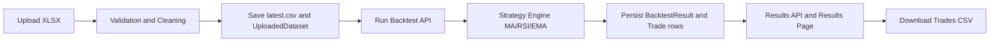

# Web Development Project Journal Paper
## Comprehensive Research and Implementation Report

## Project Title
Kinetic Observatory: Web-Based Stock Backtesting and Visualization Platform

## Academic Details
- Course: CSE3243 Web Programming Lab
- Project Type: Mini Project
- Department: Computer Science and Engineering
- Institution: MIT Manipal
- Academic Year: 2025-2026

## Student and Guide Details
- Student 1: YashVardhan Gupta (Roll No. 55, Reg No. 230905442)
- Student 2: Shubhendu Arya (Roll No. 56, Reg No. 230905458)
- Student 3: Daksh Rathee (Roll No. 54, Reg No. 230905428)
- Section: B
- Faculty Guide: Dr Manjunath K N and Dr Raviraja Holla M
- Submission Date: 21.04.2026

---

## Abstract
Kinetic Observatory is a Django-based financial web application developed to perform simplified stock strategy backtesting in an educational setting. The system accepts OHLCV market datasets in Excel format, validates and cleans the data, executes one selected strategy at a time (Moving Average, RSI, or EMA), and produces interpretable outputs including trade logs, total profit/loss, number of trades, and win percentage.

The platform emphasizes usability and reproducibility through a clean workflow: upload data, run strategy, inspect results, and download CSV trade logs. A dark terminal-style responsive UI improves presentation quality for viva and demonstration. Backend reliability is supported through form validation, deterministic strategy logic, persisted results in SQLite, and a test suite covering upload validation, strategy engine behavior, API flow, and CSV export.

The project demonstrates full-stack web engineering fundamentals with domain-specific application in quantitative finance and educational trading analytics.

---

## Table of Contents
- 1. Introduction
- 2. Literature Review
- 3. Methodology
- 4. System Architecture
- 5. Implementation Details
- 6. User Experience and Interface Design
- 7. Testing and Validation
- 8. Results and Discussion
- 9. Future Work and Recommendations
- 10. Conclusion
- References

---

## 1. Introduction

### 1.1 Background and Context
Financial markets generate large streams of OHLCV (Open, High, Low, Close, Volume) data. Backtesting is a common method for evaluating trading rules on historical data before real-world deployment. Many enterprise platforms are feature-rich but difficult for beginners. This project addresses that gap by building a compact, explainable, and reproducible backtesting tool suitable for lab work and academic presentations.

#### Motivation for the web development project
- Create a practical and demonstrable full-stack application in Django.
- Combine data engineering, finance logic, and UI design in one system.
- Deliver a product with clear user flow and visual polish.

#### Problem statement
Students and beginners often lack a lightweight platform to upload market data, apply core technical strategies, and interpret outputs without complex infrastructure.

#### Project significance
- Bridges theoretical strategy concepts with implementable code.
- Demonstrates real use of form validation, APIs, persistence, and testing.
- Provides an extensible foundation for advanced analytics.

### 1.2 Research Objectives
#### Primary goals
- Build an end-to-end web application for strategy backtesting.
- Support upload, strategy execution, result visualization, and CSV export.
- Ensure consistent validation and reliable outputs.

#### Specific research questions
- Can simple technical strategies be modeled in an explainable way for students?
- Can the workflow be made robust against common data format issues?
- Can backend correctness be validated with automated tests?

#### Scope of the project
- Supports `.xlsx` input only.
- Supports one strategy execution per run: MA, RSI, or EMA.
- Focuses on long-side trade simulation with fixed initial capital.
- Uses local SQLite storage and local media files.

### 1.3 Thesis Statement
A streamlined Django architecture with strict data validation and deterministic strategy logic can deliver a reliable, beginner-friendly backtesting platform that is both academically demonstrable and technically extensible.

---

## 2. Literature Review

### 2.1 Web Development Landscape
Modern web systems favor modular backend APIs, responsive UI, and test-first reliability. Python/Django remains strong for rapid development due to batteries-included architecture (ORM, forms, admin, routing), while JavaScript-powered frontends enable interactive experiences.

#### Current trends in web technologies
- API-driven workflows with asynchronous frontend calls.
- Validation-centric data ingestion pipelines.
- Responsive dashboard UIs for analytics applications.

#### Emerging frameworks and tools
- FastAPI and Node-based stacks for API-first systems.
- React/Vue for component-based interfaces.
- Data tooling around Pandas and vectorized computation.

#### Industry best practices
- Validate at input boundaries.
- Keep business logic separate from presentation.
- Add repeatable tests for critical flows.
- Persist only meaningful artifacts for reproducibility.

### 2.2 Related Works
#### Comparative analysis of similar projects
- Trading platforms such as TradingView offer rich charting and scripting, but are less tailored for course mini-project pedagogy.
- Python libraries such as backtrader and zipline are powerful but may require steeper setup and abstraction understanding.
- Spreadsheet-only workflows are accessible but weak in automation and reproducibility.

#### Gaps in existing solutions
- Beginner-oriented, end-to-end web UX is often missing.
- Academic demonstration needs simple flow over excessive complexity.
- Data validation and explainability are often underemphasized.

---

## 3. Methodology

### 3.1 Research Design
The project uses an iterative engineering methodology:
1. Define minimal viable workflow (Upload -> Run -> Results -> Download).
2. Implement robust input validation and cleaning.
3. Implement deterministic strategy engine.
4. Persist outcomes in database models.
5. Validate via unit and integration tests.
6. Refine UI and data presentation for clarity.

#### Research approach
- Applied software engineering approach with domain-specific logic.
- Rule-based quantitative methods (non-ML).
- Black-box and white-box testing for reliability.

#### Methodological framework
- Input normalization and schema validation.
- Signal generation from historical price series.
- Trade simulation with quantity sizing from fixed capital.
- Summary metric calculation and persistence.

#### Development lifecycle model
- Incremental iterative model.
- Feature-first implementation followed by validation cycles.

### 3.2 Technology Stack
#### Frontend technologies
- HTML templates (Django templating)
- CSS (custom terminal-style design)
- Bootstrap 5
- JavaScript + jQuery/AJAX

#### Backend technologies
- Python 3.x
- Django 5.2+
- Pandas + NumPy

#### Database and infrastructure
- SQLite database
- Django ORM
- Local media storage for datasets and latest cleaned CSV

#### Rationale for technology selection
- Django enables rapid feature delivery and admin support.
- Pandas simplifies robust dataset cleaning and transformation.
- SQLite is suitable for lightweight educational deployment.

---

## 4. System Architecture

### 4.1 Frontend Architecture
The UI is organized into three functional pages:
- Upload page for dataset ingestion.
- Dashboard page for strategy setup and execution.
- Results page for metrics and trade log inspection.

State transitions are API-driven and synchronized through backend sessions and result IDs.

### 4.2 Backend Architecture
The backend consists of forms, views, services, and models:
- Forms validate file and strategy parameters.
- Services handle cleaning and backtesting.
- Views orchestrate HTTP APIs and rendering.
- Models persist datasets, backtest summaries, and individual trades.

### High-Level Data Flow


### Database Schema Summary
- UploadedDataset
  - file, original_name, row_count, column_snapshot, uploaded_at
- BacktestResult
  - dataset FK, symbol, strategy_name, parameters, profit, trade_count, metrics, created_at
- Trade
  - backtest_result FK, side, entry/exit date, entry/exit price, quantity, profit, profit_pct
- Portfolio
  - optional one-to-one record for paper-trading style extensions

### API Surface
- `POST /upload/`
- `POST /run-backtest/`
- `POST /run-backtest-api/`
- `POST /backtest/` (compatibility alias)
- `GET /results/`
- `GET /download-trades/`

---

## 5. Implementation Details

### 5.1 Development Environment
#### Tools and software
- Python, pip, virtualenv
- Django, Pandas, NumPy, openpyxl, xlrd
- VS Code
- Git

#### Version control strategies
- Incremental commits by feature/fix.
- Isolation of static assets, templates, and services by concern.

#### Cross-platform setup commands
Windows PowerShell:
```powershell
python -m venv venv
.\venv\Scripts\Activate.ps1
python -m pip install --upgrade pip
python -m pip install -r requirements.txt
cd backend\core
python manage.py makemigrations
python manage.py migrate
python manage.py createsuperuser
python manage.py test trading
python manage.py runserver
```

Windows CMD:
```bat
python -m venv venv
venv\Scripts\activate.bat
python -m pip install --upgrade pip
python -m pip install -r requirements.txt
cd backend\core
python manage.py makemigrations
python manage.py migrate
python manage.py createsuperuser
python manage.py test trading
python manage.py runserver
```

macOS/Linux:
```bash
python3 -m venv venv
source venv/bin/activate
python -m pip install --upgrade pip
python -m pip install -r requirements.txt
cd backend/core
python manage.py makemigrations
python manage.py migrate
python manage.py createsuperuser
python manage.py test trading
python manage.py runserver
```

### 5.2 Core Features
#### Dataset validation and cleaning
- Accepts only `.xlsx` files.
- Normalizes headers to lowercase and maps aliases:
  - `timestamp`, `datetime`, `time` -> `date`
- Enforces required columns: date/open/high/low/close/volume.
- Coerces data types, removes invalid rows, sorts chronologically.

#### Strategy engine
The system supports MA, RSI, and EMA strategies.

- MA logic:
  - Buy when short MA > long MA.
  - Exit when short MA < long MA.

- RSI logic:
  - Buy when RSI < 30.
  - Exit when RSI > 70.

- EMA logic:
  - Buy when Close > EMA.
  - Exit when Close < EMA.

Quantity sizing:

$$
q = \max(\lfloor \frac{capital}{buy\_price} \rfloor, 1)
$$

Per-trade profit:

$$
profit = (sell\_price - buy\_price) \times q
$$

#### Persisted result and analytics
- Initial balance (default 100000)
- Total profit/loss
- Number of trades
- Win percentage
- Trade log with quantity and capital allocated

#### CSV export
- Produces downloadable trade log with entry/exit time, prices, quantity, capital allocated, and profit.

#### Technical challenges and solutions
- Header mismatch in uploaded files solved by alias normalization.
- Backtest trigger reliability improved with explicit route binding and fallback click logic.
- Time display consistency addressed by formatting to `Asia/Kolkata`.
- Capital metric clipping in UI solved through formatting and typography adjustments.

### 5.3 Performance Optimization
#### Performance testing methodologies
- Repeated strategy runs on sample datasets.
- Full request-response validation via Django test client.

#### Optimization techniques
- Vectorized Pandas transformations for cleaning.
- Duplicate-date removal and sorted indexing.
- `bulk_create` for writing trade rows efficiently.
- Session pointers for latest dataset and result retrieval.

#### Benchmarking results
Based on recent run:
- Automated test execution completed with 9 tests in approximately 0.36 seconds.
- Django system check reported no issues.

---

## 6. User Experience and Interface Design

### 6.1 User Interface (UI) Design
#### Design philosophy
- Dark trading-terminal aesthetic for domain consistency.
- Reduced cognitive load with three-page workflow.
- Emphasis on actionable metrics and clean trade tables.

#### Responsive design principles
- Bootstrap grid used for adaptive layout.
- Cards and tables designed for desktop-first with mobile fallback.

#### Interaction design
- Upload and backtest use API-driven interactions.
- Result summaries update quickly and enable direct CSV export.

---

## 7. Testing and Validation

### 7.1 Testing Strategies
#### Unit testing
- Dataset validation for file type and required columns.
- Form validation for MA/RSI/EMA parameter correctness.

#### Integration testing
- Upload + backtest + results + CSV pipeline tested through Django client.

#### End-to-end testing
- Full workflow from file upload to downloadable output verified.

### 7.2 Validation Results
#### Test coverage scope
- Service-level validation and cleaning.
- Strategy payload shape and trade generation.
- API response and persistence behavior.
- CSV content generation.

#### Recent execution evidence
- Command: `python manage.py check`
  - Result: System check identified no issues (0 silenced).

- Command: `python manage.py test trading`
  - Result: 9 tests executed successfully.
  - Status: OK

#### Quality assurance processes
- Defensive validation at input boundaries.
- Transactional persistence for backtest writes.
- Regression checks after UI/backend changes.

---

## 8. Results and Discussion

### 8.1 Project Outcomes
#### Achievement of project objectives
- Built and validated complete upload-to-analysis pipeline.
- Delivered strategy execution for MA/RSI/EMA.
- Produced persistent trade records and downloadable CSV output.
- Delivered polished UI suitable for viva demonstration.

#### Quantitative and qualitative results
- Sample run in screenshots demonstrates:
  - Trade count: 71
  - Win percent: 35.21%
  - Total P/L displayed as loss/profit labels
- Qualitative benefit: beginner-friendly interpretation of strategy output.

### 8.2 Critical Analysis
#### Strengths of the implementation
- Clean modular separation (forms, services, views, models).
- Robust upload validation with flexible header aliases.
- Explainable strategy rules and deterministic results.
- Good balance of backend correctness and UI usability.

#### Limitations and constraints
- Only `.xlsx` upload currently supported.
- Long-side strategy execution only.
- No brokerage/slippage modeling.
- No real-time market feed.

#### Lessons learned
- Data normalization is essential for user-submitted files.
- UI reliability depends on robust event binding and clear error states.
- Automated tests significantly reduce regression risk.

### 8.3 Screenshots and Output

#### Figure 1: Upload Page


#### Figure 2: Dashboard Page


#### Figure 3: Strategy Dropdown Interaction


#### Figure 4: Results Page


#### Figure 5: Trade CSV Output Snapshot


#### Figure 6: Django Admin Login


#### Figure 7: Django Admin Home


#### Figure 8: Admin Backtest Results Listing


---

## 9. Future Work and Recommendations

### 9.1 Potential Improvements
#### Suggested enhancements
- Add short-selling simulation mode.
- Add multi-strategy comparison in one execution run.
- Add equity curve, drawdown, Sharpe ratio, and risk metrics.
- Add transaction cost, brokerage, and slippage models.

#### Scalability considerations
- Move from SQLite to PostgreSQL for larger workloads.
- Add asynchronous task queue for heavy backtest jobs.
- Add caching layer for repeated result retrieval.

#### Technology evolution roadmap
- Optional migration to component frontends (React/Vue).
- API hardening with schema docs and versioning.
- Deployment on cloud infrastructure with CI/CD.

### 9.2 Research Implications
#### Contribution to web development knowledge
- Demonstrates a practical full-stack educational analytics pattern.
- Shows how domain logic can be integrated with structured validation.

#### Potential industry applications
- Internal strategy prototyping tools.
- Educational fintech labs and training programs.
- Lightweight analytics dashboards for small trading desks.

---

## 10. Conclusion
Kinetic Observatory successfully fulfills the objective of building a compact, robust, and visually polished web-based backtesting platform. The project combines reliable data ingestion, deterministic strategy simulation, meaningful output metrics, database persistence, and user-centric interface design. Validation through automated tests and system checks confirms functional reliability.

The system is ready for academic demonstration and provides a strong foundation for future expansion into advanced quantitative and production-grade trading analytics.

---

## References
1. Django Documentation. https://docs.djangoproject.com/
2. Pandas Documentation. https://pandas.pydata.org/docs/
3. NumPy Documentation. https://numpy.org/doc/
4. Investopedia. Relative Strength Index (RSI). https://www.investopedia.com/terms/r/rsi.asp
5. Investopedia. Exponential Moving Average (EMA). https://www.investopedia.com/terms/e/ema.asp
6. Investopedia. Simple Moving Average (SMA). https://www.investopedia.com/terms/s/sma.asp
7. Bootstrap Documentation. https://getbootstrap.com/docs/
8. jQuery Documentation. https://api.jquery.com/

---

## Appendix A: Quick Command Checklist
```bash
# From repository root
python -m venv venv
# Activate venv (OS specific)
python -m pip install -r requirements.txt
cd backend/core
python manage.py migrate
python manage.py createsuperuser
python manage.py test trading
python manage.py runserver
```
